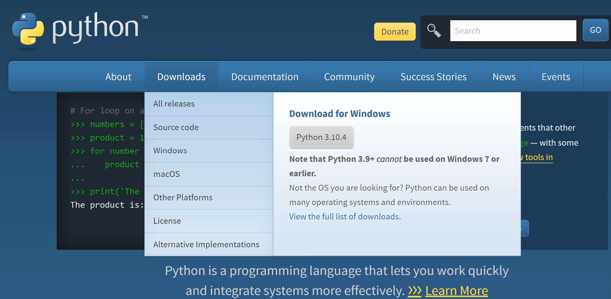
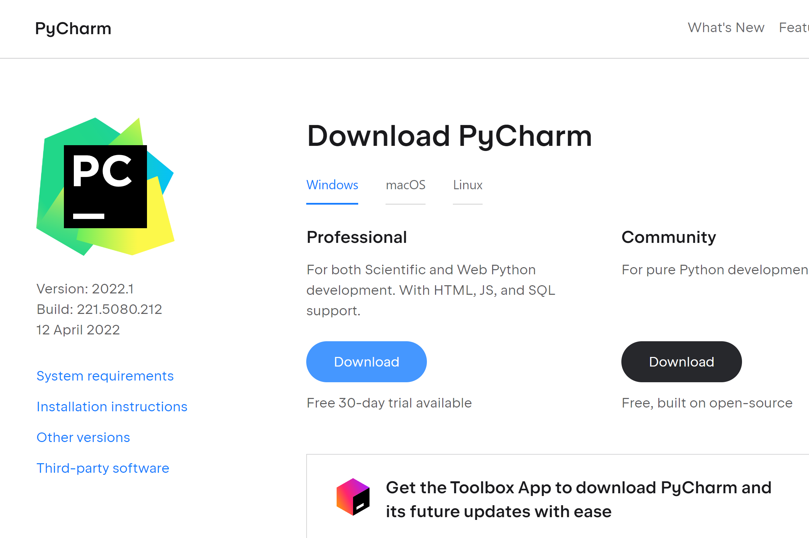
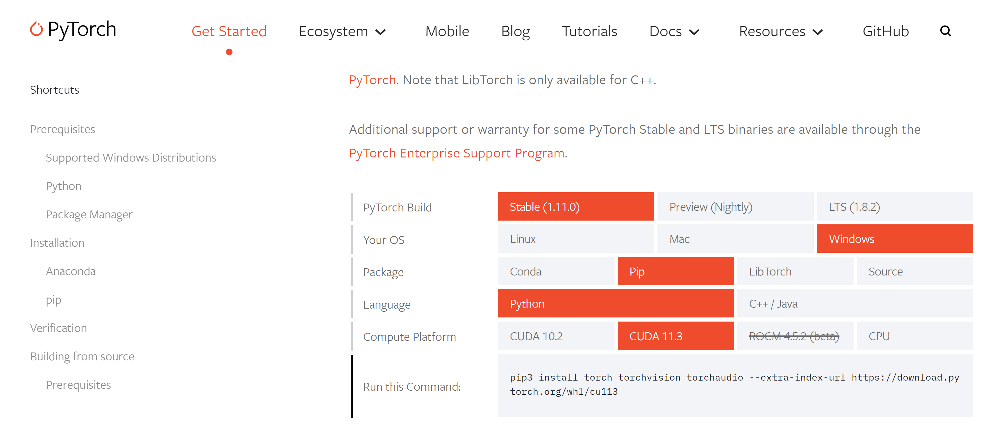
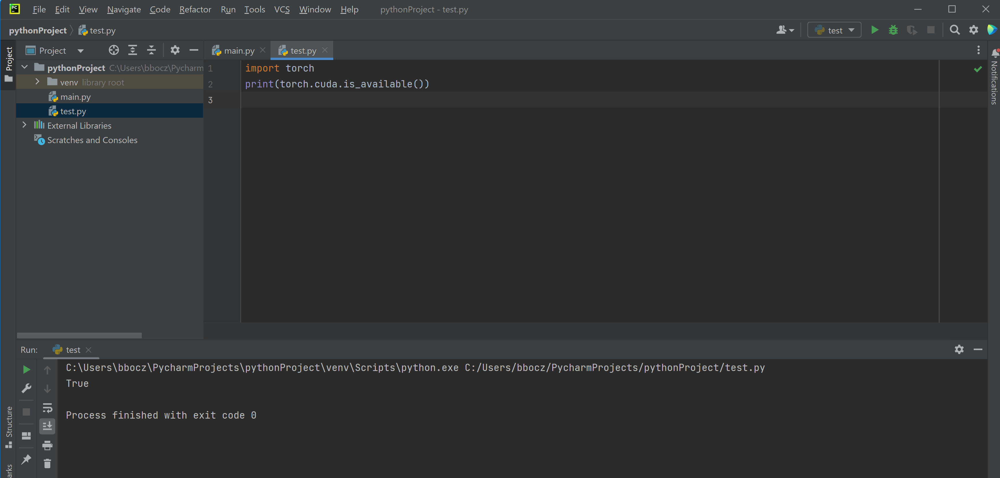
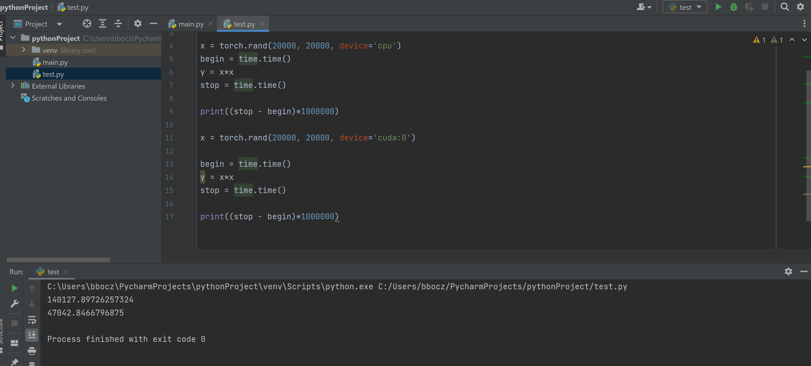
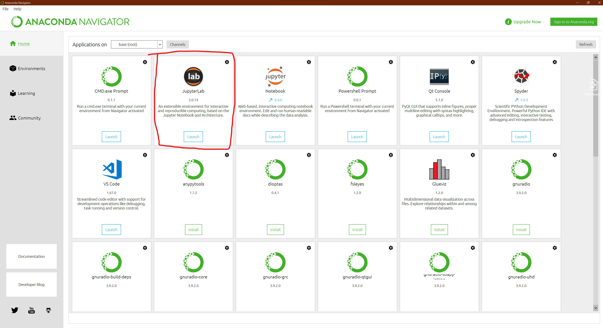
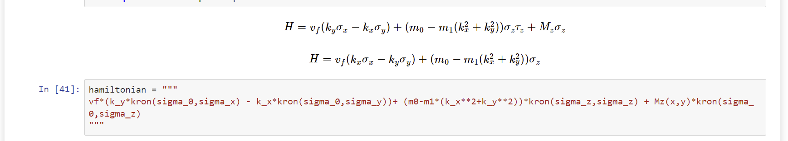
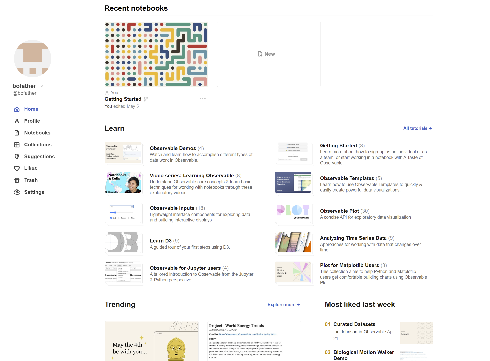
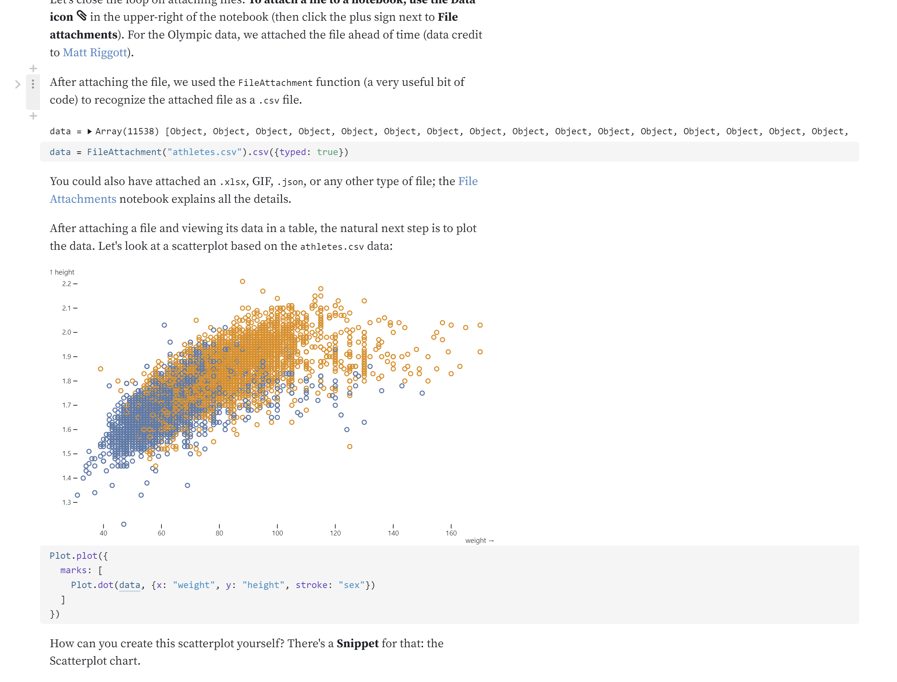
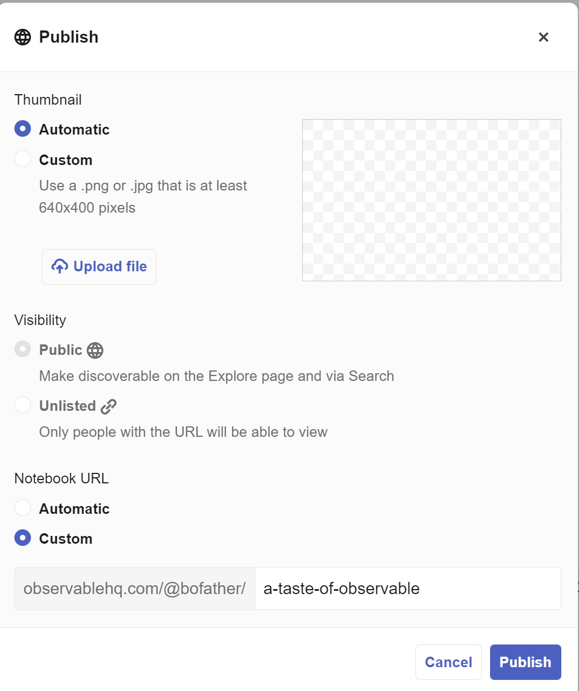

# Why You Do Not Need Hedgehog Lab: 
## 全网最好，不需要你懂得任何编程和计算机知识的，GPU 加速Python安装5分钟教程
**只用5分钟，服务一万年**

下面花5分钟介绍正确在本地安装GPU加速的Python，以及让您安装完后的第一分钟就可以书写您最爱的Python代码并且随时看到运行结果的办法。

## 好消息，这绝对不需要您懂得任何命令行或者计算机的知识。您不需要是计算机专业的学生，本教程最合适的，恰恰是商学院等有数据处理需求的学生们

- **第一步**，打开<https://www.python.org/downloads/>下载符合您电脑操作系统类型的最新版的Python

小提示：这一步和您安装任何游戏、杀毒软件和黄色网站直播app一样，打开双击安装即可。我相信应该难不倒你吧？



预计花费时间：1分钟

- **第二步**，打开<https://www.jetbrains.com/pycharm/download>下载全球最好用最稳定最一致的Python所见即所得可视化IDE编程工具，让你摆脱对命令行和PIP的依赖（与困扰）



预计花费时间：2分钟

小提示：这个工具有详细的提示；但最重要的是，他不需要你学会任何操作就能运行你的第一个python文件，他会自动默认选择您刚才安装好的python最新版作为python的interpreter（您不需要知道这是什么东西），在默认的main.py 中输入**1+1**，点击绿色的运行按钮，你就能看到**2**了。

- **第三步**，用全新免洗面免脑全球最强深度学习，矩阵运算，GPU加速库Pytorch安装方法



打开<https://pytorch.org/get-started/locally/>，选择您的操作系统(Windows），再选择PIP，再选择Python，最后再选择CUDA 11.3即可。这样最后的结果是：

    pip3 install torch torchvision torchaudio --extra-index-url https://download.pytorch.org/whl/cu113

复制如下代码到您最新打开的main.py中，点击绿色按钮运行，即可安装


```py
import os

os.system('pip3 install torch torchvision torchaudio --extra-index-url https://download.pytorch.org/whl/cu113')
```

- **最后一步**，最后一步，运行下列代码证明自己的Pytorch和CUDA已经正确完整的安装成功啦！

```py
import torch

print(torch.cuda.is_available())
```

最后的结果应该是



```py
True
```

## 计算速度比较结果




# Hedgehog lab数据和代码都在云端，怕被偷窥？快使用Jupyter-lab搭建科学计算！

打开<https://www.anaconda.com/products/distribution/download-success-2>, 选择操作系统， 安装anaconda。打开anaconda navigator GUI:


安装并运行jupyter-lab:


新建一个Python3的notebook，你就可以立刻在窗口下进行你想要的计算、绘图了！


可以保存为任意格式，比如latex方便显示公式



老师搭建，学生即可使用老师的服务器进行计算(登录ip:8888即可) <https://towardsdatascience.com/how-to-connect-to-jupyterlab-remotely-9180b57c45bb>。
你自己的服务器搭建之后也可以在本地使用自己得服务器计算哦！比Hedgehog lab安全、可靠、方便呢！

# Hedgehog lab计算慢，不方便放在个人博客？快使用Observable经行浏览器端的可视化和在线！
想在你的公司网页中让你的用户直接交互式体验可视化的数据吗？Hedgehog lab，又不安全也无隐私，还需要远程服务器渲染，开销大，怎么让用户电脑本地渲染呢？

打开<https://observablehq.com/>，使用你的github账户登录即可。


随便点开一个demo，Fork成为你自己的库吧！

拥有hedgehog lab所有的特征，便于分享、可用于公司的网站哟！

立刻可以公开的你网页<https://observablehq.com/@bofather/a-taste-of-observable>

还可以通过embed功能自动生成JS代码，嵌入你的公司主页、个人博客！是不是完爆hedgehog lab?
